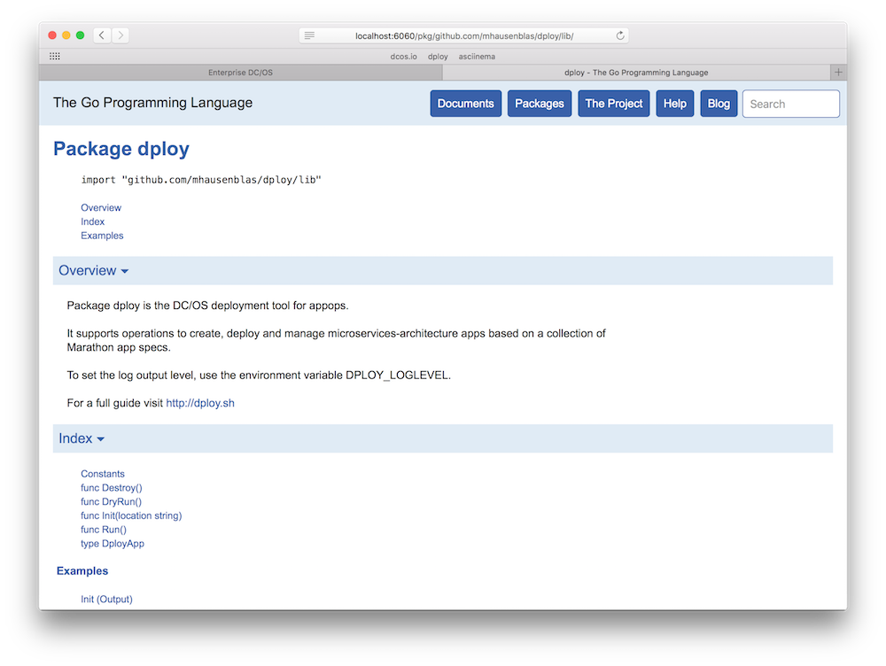

# dploy

dploy, the [DC/OS](https://dcos.io) deployment tool for appops allows you to create, deploy and manage apps based on a collection of Marathon app specs written in JSON.

## Installation

From source:

    $ go get github.com/mhausenblas/dploy
    $ go build

Download binaries:

    TBD

To simplify the [DC/OS oauth](https://dcos.io/docs/1.7/administration/security/) handling, you can create a SSH tunnel from your local machine to the DC/OS master like so:

    $ ssh -i ~/.ssh/MYKEY core@MYMASTER -f -L 8080:localhost:8080 -N

From here on, you can use `http://localhost:8080` for the Marathon URL (`marathon_url`) in the `dploy.app` file.

## Dependencies

- [DC/OS 1.7](https://dcos.io/releases/1.7.0/)
- [github.com/gambol99/go-marathon](https://github.com/gambol99/go-marathon), an API library for working with Marathon.
- [github.com/Sirupsen/logrus](https://github.com/Sirupsen/logrus), a logging library.

## Workflow

### Commands

- [x] `dploy init` … creates a new app for you, that is, a `dploy.app` file with default values is created in `-location`
- [x] `dploy dryrun` … validates deployment of the app by checking if DC/OS cluster is valid, validates app specs, etc.
- [x] `dploy run`… launches the app using the Marathon API
- [ ] `dploy destroy`… tears down your app
- [ ] `dploy ls` … lists the content of the app, all its resources such as Marathon app specs, etc.
- [ ] `dploy ps` … lists runtime properties of the app, such as on which node/port its running, etc.
- [ ] `dploy update`… lets you update properties of the app, such as scaling or environment variables
- [ ] `dploy publish` … publishes the app in the DC/OS Universe

### Logging

To set the log level for `dploy`, use the environment variable `DPLOY_LOGLEVEL`. For example, to set it globally use `export DPLOY_LOGLEVEL=debug` or to enable debug output on a per-run basis, you can use `DPLOY_LOGLEVEL=info dploy dryrun`.

Note that the default value for `DPLOY_LOGLEVEL` is `error` (that is, if you don't set the environment variable).

### Docs

To view the Go package doc locally, do the following:

    $ git clone https://github.com/mhausenblas/dploy.git && cd dploy
    $ export GO_PATH=`pwd`
    $ godoc -http=":6060"

If you now visit [localhost:6060/pkg/github.com/mhausenblas/dploy/dploy/](http://localhost:6060/pkg/github.com/mhausenblas/dploy/dploy/) in your favorite Web browser you should be able to see the `dploy` package docs:

